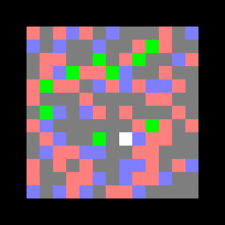
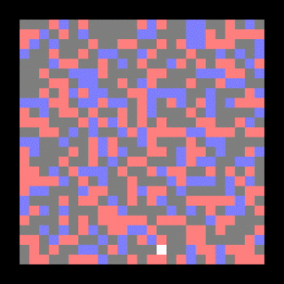
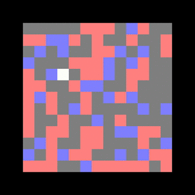

# Rainbow_RL
Reinforcement Learning Project implementing DQN and variations, inspired by
Rainbow: Combining Improvements in Deep Reinforcement Learning ‎(arXiv:1710.02298)

## Command lines
To train from scratch or test :
```shell
python3 main.py --s [solver] -a [action] -n [number of hunters]
```

[solver] can be : "dqn", "double_dqn", "dueling_dqn", "prioritized_dqn", "distributional_dqn", "noisy_dqn", "multistep_dqn" or "human"

[action] can be : "test", to test an already existing model or "validate", to train and test a model from scratch

[number of hunters] is be any non-negative integer


At every test and train, videos of games (.mp4), models weights (.json and .h5) and performance vector (.pkl) will automatically be saved in the repository

To plot the analysis curves :
```shell
python3 plot.py
```

## Examples

### Example of DQN agent in a 10-cats (hunters) environment



### Example of DoubleDQN agent in a 25x25 grid



### Example of PrioritizedDQN agent in a 13x13 grid


